# 创升纪元（Ascension）· 第四版 + 史诗传奇

> 转录自微信公众号「悠叶游YOUYEYOU」产品介绍文《创升纪元中文正版第四版 新品Ascension暗杀神卡牌DBG桌游游戏》（2024）。
> 该文为官方中文版产品介绍，含「创升纪元 第四版」与独立扩展「创升纪元：史诗传奇」两个产品的背景故事、配件清单与玩法概览。本文按原图逐张转录，游戏原图随文嵌入。
> 规则内容归 Stone Blade Entertainment 及版权方所有，转录仅供个人学习查阅。

**整理说明**：转录以公众号正文图片为底本逐张照录。原贴系产品宣传文案，个别语句与官方规则书用词不一（如以「中央牌列」称中央牌列排、「荣誉指示物体」），均照录并以〔原文如此〕标注；纯装饰图（板图特写、章节花框）两幅未收录，正文图序号相应跳缺（06、17）。

---

## 一、创升纪元 · 第四版

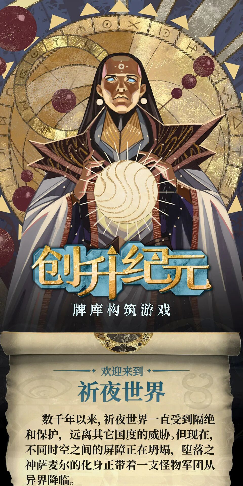

### 欢迎来到祈夜世界

数千年以来，祈夜世界一直受到隔绝和保护，远离其它国度的威胁。但现在，不同时空之间的屏障正在坍塌，堕落之神萨麦尔的化身正带着一支怪物军团从异界降临。

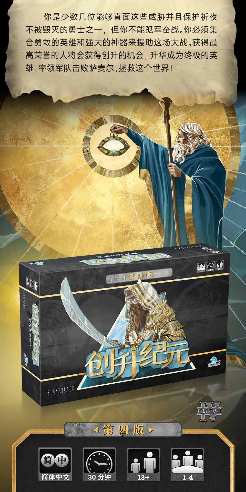

你是少数几位能够直面这些威胁并且保护祈夜〔原文如此，即祈夜世界〕不被毁灭的勇士之一，但你不能孤军奋战。你必须集合勇敢的英雄和强大的神器来援助这场大战。获得最高荣誉的人将会获得创升的机会，升华成为终极的英雄，率领军队击败萨麦尔，拯救这个世界！

- 语言版本：简体中文
- 支持人数：1-4 人
- 游戏时长：30 分钟
- 适合年龄：13 岁以上
- 游戏机制：手牌管理，牌库构筑

### 经久不衰的卡牌 DBG 桌游代表作

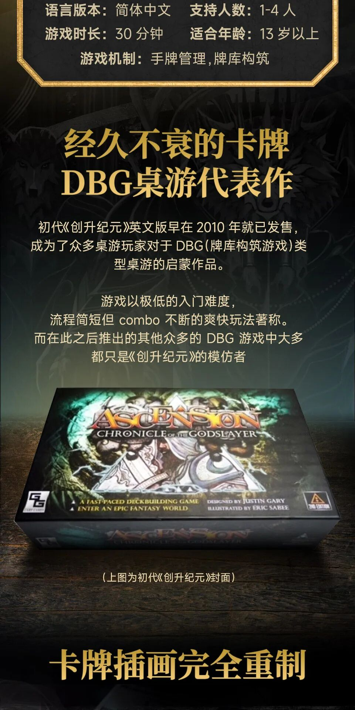

初代《创升纪元》英文版早在 2010 年就已发售，成为了众多桌游玩家对于 DBG（牌库构筑游戏）类型桌游的启蒙作品。

游戏以极低的入门难度，流程简短但 combo 不断的爽快玩法著称。而在此之后推出的其他众多的 DBG 游戏中大多都只是《创升纪元》的模仿者。

（上图为初代《创升纪元》封面）

### 卡牌插画完全重制

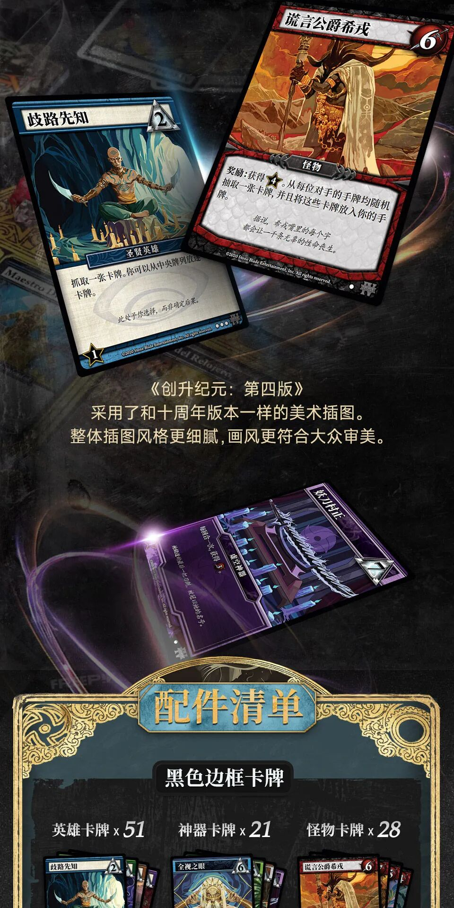

《创升纪元：第四版》采用了和十周年版本一样的美术插图。整体插图风格更细腻，画风更符合大众审美。

### 配件清单（第四版）

**黑色边框卡牌**

- 英雄卡牌 × 51
- 神器卡牌 × 21
- 怪物卡牌 × 28

**银色边框卡牌**

- 秘教士 × 20
- 重装步兵 × 20
- 邪教徒 × 1

**白色边框卡牌**

- 初始牌组 × 4 套（每套为 8 张学徒和 2 张民兵）

共计 181 张卡牌。

另有：50 枚荣誉指示物体〔原文如此〕、游戏规则书、豪华游戏板图。

（黑框/银框/白框卡牌见上图、下图）

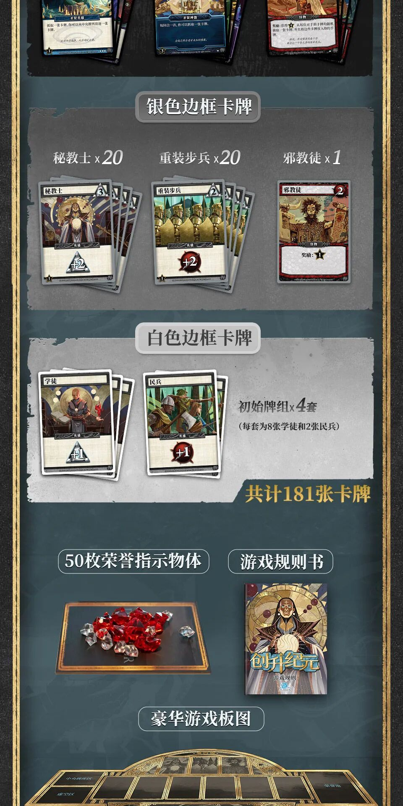

### 游戏玩法（第四版）

#### 卡牌类型 · 英雄卡牌

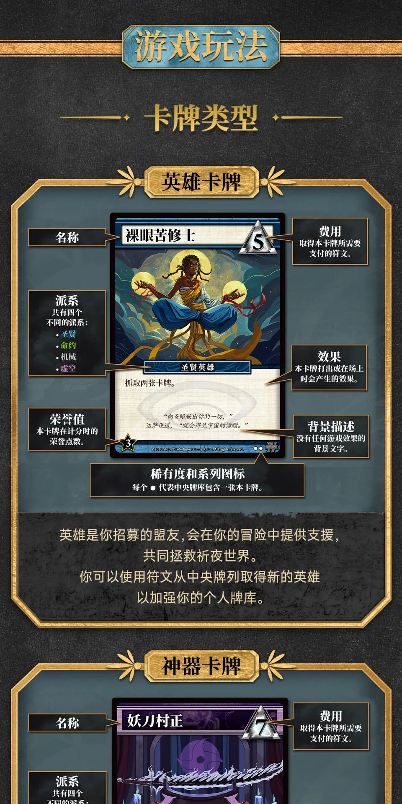

- **名称**：裸眼苦修士
- **费用**：取得本卡牌所需要支付的符文。
- **派系**：共有四个不同的派系：圣贤、宿约、机械、虚空。
- **效果**：本卡牌打出或在场上时会产生的作用。
- **荣誉值**：本卡牌在计分时的荣誉点数。
- **背景描述**：没有任何游戏效果的背景文字。
- **稀有度和系列图标**：每个 ● 代表中央牌库包含一张本卡牌。

英雄是你招募的盟友，会在你的冒险中提供支援，共同拯救祈夜世界。你可以使用符文从中央牌列取得新的英雄以加强你的个人牌库。

#### 卡牌类型 · 神器卡牌

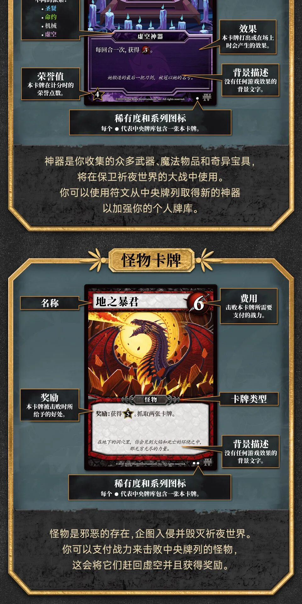

（示例卡：妖刀村正，费用 7，虚空神器，「每回合一次，获得 3。」荣誉值 4）

- **名称**
- **费用**：取得本卡牌所需要支付的符文。
- **派系**：共有四个不同的派系：圣贤、宿约、机械、虚空。
- **效果**：本卡牌打出或在场上时会产生的作用。
- **荣誉值**：本卡牌在计分时的荣誉点数。
- **背景描述**：没有任何游戏效果的背景文字。
- **稀有度和系列图标**：每个 ● 代表中央牌库包含一张本卡牌。

神器是你收集的众多武器、魔法物品和奇异宝具，将在保卫祈夜世界的大战中使用。你可以使用符文从中央牌列取得新的神器以加强你的个人牌库。

#### 卡牌类型 · 怪物卡牌

- **名称**：地之暴君
- **费用**：击败本卡牌所需要支付的战力。
- **奖励**：本卡牌被击败时所给予的好处。
- **卡牌类型**
- **背景描述**：没有任何游戏效果的背景文字。
- **稀有度和系列图标**：每个 ● 代表中央牌库包含一张本卡牌。

怪物是邪恶的存在，企图入侵并毁灭祈夜世界。你可以支付战力来击败中央牌列的怪物，这会将它们赶回虚空并且获得奖励。

#### 游戏流程

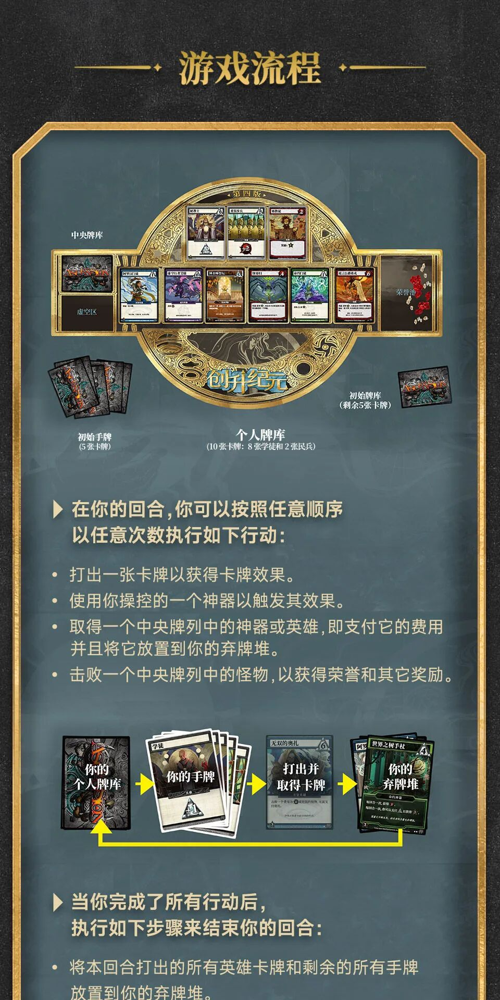

版图各区域：中央牌库 / 中央牌列；初始牌库（剩余 5 张卡牌）；初始手牌（5 张卡牌）；个人牌库（10 张卡牌：8 张学徒和 2 张民兵）。

**在你的回合，你可以按照任意顺序以任意次数执行如下行动：**

- 打出一张卡牌以获得卡牌效果。
- 使用你操控的一个神器以触发其效果。
- 取得一个中央牌列中的神器或英雄，即支付它的费用并且将它放置到你的弃牌堆。
- 击败一个中央牌列中的怪物，以获得荣誉和其它奖励。

卡牌流动：你的个人牌库 → 你的手牌 → 打出并取得卡牌 → 你的弃牌堆（循环）。

**当你完成了所有行动后，执行如下步骤来结束你的回合：**

- 将本回合打出的所有英雄卡牌和剩余的所有手牌放置到你的弃牌堆。
- 从你的个人牌库抓取五张卡牌，作为下个回合的手牌。

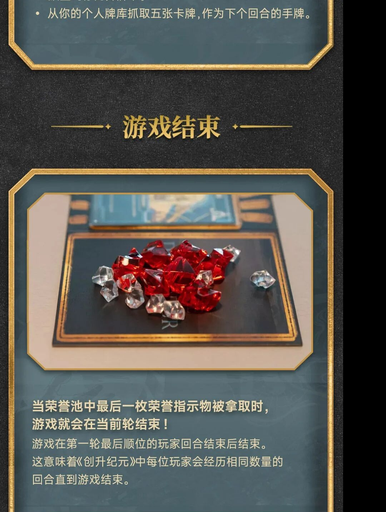

#### 游戏结束

当荣誉池中最后一枚荣誉指示物被拿取时，游戏就会在当前轮结束！游戏在第一轮最后顺位的玩家回合结束后结束。这意味着《创升纪元》中每位玩家会经历相同数量的回合直到游戏结束。

#### 计分

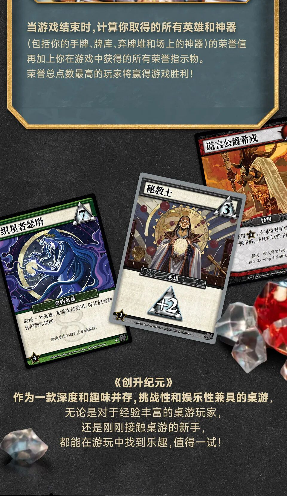

当游戏结束时，计算你取得的所有英雄和神器（包括你的手牌、牌库、弃牌堆和场上的神器）的荣誉值再加上你在游戏中获得的所有荣誉指示物。荣誉总点数最高的玩家将赢得游戏胜利！

> 《创升纪元》作为一款深度和趣味并存，挑战性和娱乐性兼具的桌游，无论是对于经验丰富的桌游玩家，还是刚刚接触桌游的新手，都能在游玩中找到乐趣，值得一试！

---

## 二、创升纪元：史诗传奇（独立扩展）

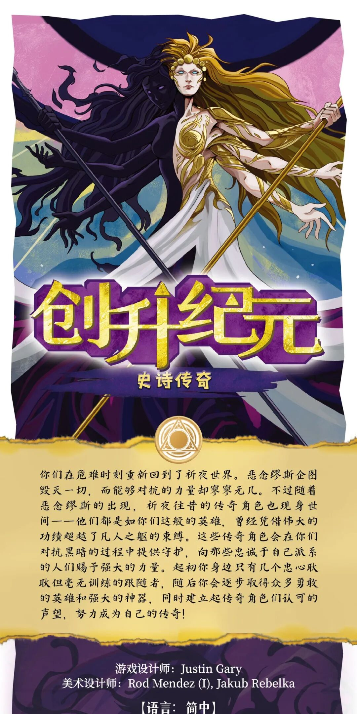

### 背景故事

你们在危难时刻重新回到了祈夜世界。恶念缪斯企图毁灭一切，而能够对抗的力量却寥寥无几。不过随着恶念缪斯的出现，祈夜往昔的传奇角色也现身世间——他们都是如你们这般的英雄，曾经凭借伟大的功绩超越了凡人之躯的束缚。这些传奇角色会在你们对抗黑暗的过程中提供守护，向那些忠于自己派系的人们赐予强大的力量。起初你身边只有几个忠心耿耿但毫无训练的跟随者，随后你会逐步取得众多勇敢的英雄和强大的神器，同时建立起传奇角色们认可的声望，努力成为自己的传奇！

- 游戏设计师：Justin Gary
- 美术设计师：Rod Mendez (I)、Jakub Rebelka
- 语言：简中

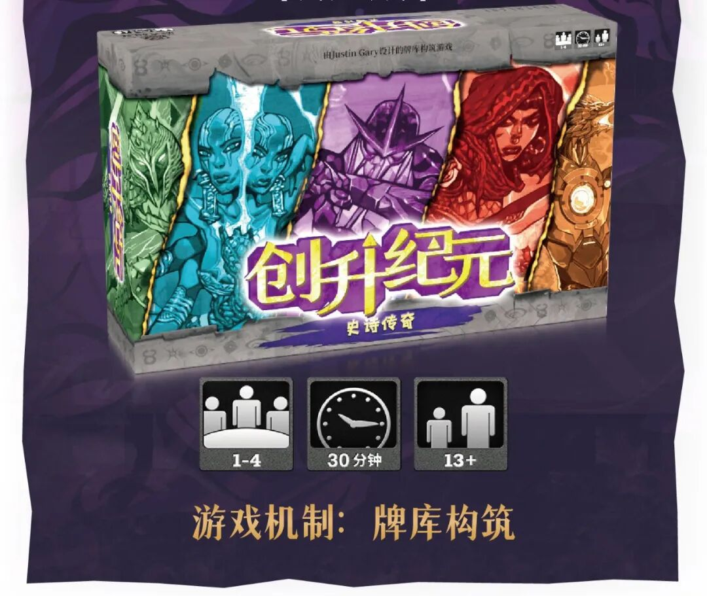

- 支持人数：1-4
- 游戏时长：30 分钟
- 适合年龄：13+
- 游戏机制：牌库构筑
- 由 Justin Gary 设计的牌库构筑游戏

### 系列简介

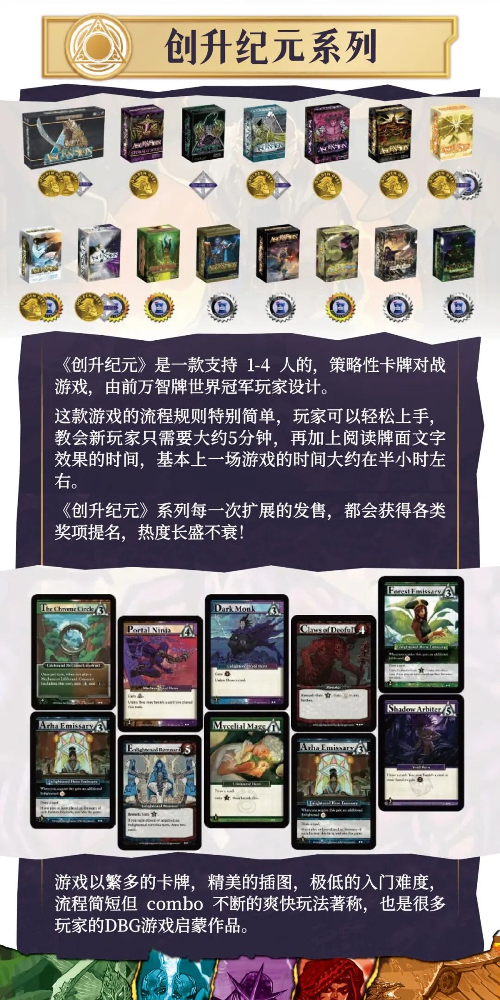

《创升纪元》是一款支持 1-4 人的，策略性卡牌对战游戏，由前万智牌世界冠军玩家设计。

这款游戏的流程规则特别简单，玩家可以轻松上手，教会新玩家只需要大约 5 分钟，再加上阅读牌面文字效果的时间，基本上一场游戏的时间大约在半小时左右。

《创升纪元》系列每一次扩展的发售，都会获得各类奖项提名，热度长盛不衰！

游戏以繁多的卡牌，精美的插图，极低的入门难度，流程简短但 combo 不断的爽快玩法著称，也是很多玩家的 DBG 游戏启蒙作品。

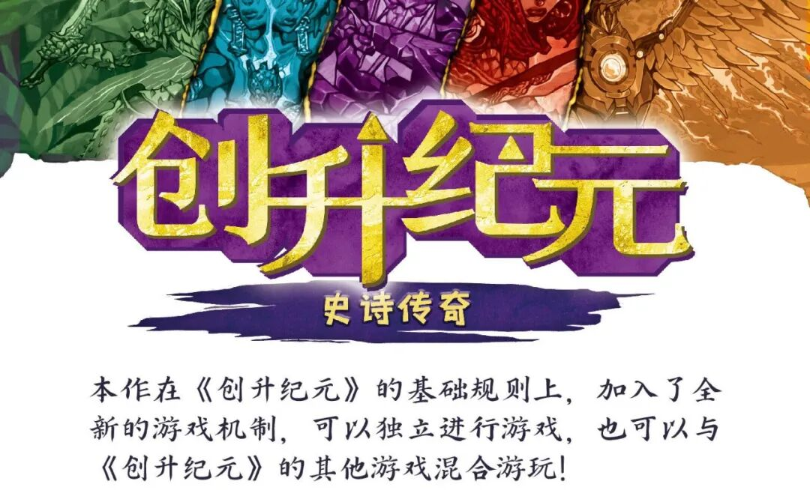

本作在《创升纪元》的基础规则上，加入了全新的游戏机制，可以独立进行游戏，也可以与《创升纪元》的其他游戏混合游玩！

### 全新机制 · 传奇之路

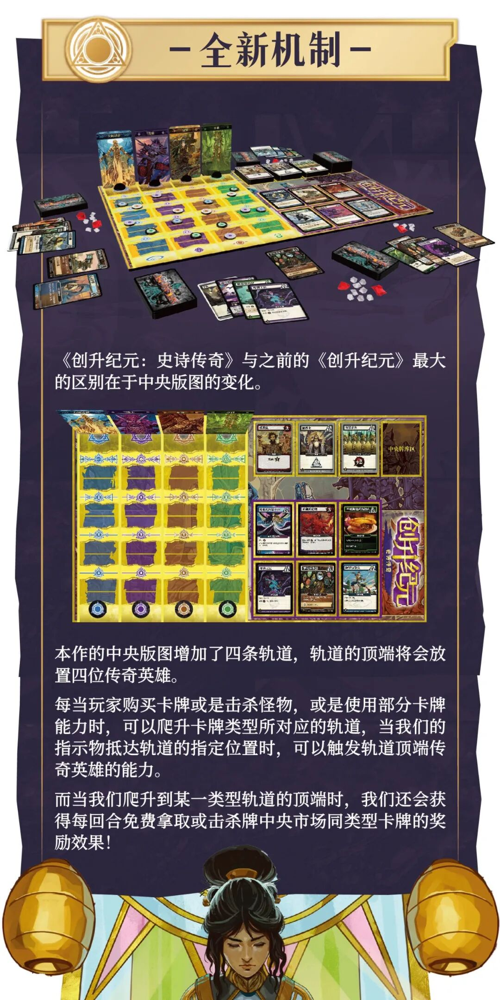

《创升纪元：史诗传奇》与之前的《创升纪元》最大的区别在于中央版图的变化。

本作的中央版图增加了四条轨道，轨道的顶端将会放置四位传奇英雄。

每当玩家购买卡牌或是击杀怪物，或是使用部分卡牌能力时，可以爬升卡牌类型所对应的轨道，当我们的指示物抵达轨道的指定位置时，可以触发轨道顶端传奇英雄的能力。

而当我们爬升到某一类型轨道的顶端时，我们还会获得每回合免费拿取或击杀牌中央市场〔原文如此，应为「中央牌列」〕同类型卡牌的奖励效果！

### 配件清单（史诗传奇）

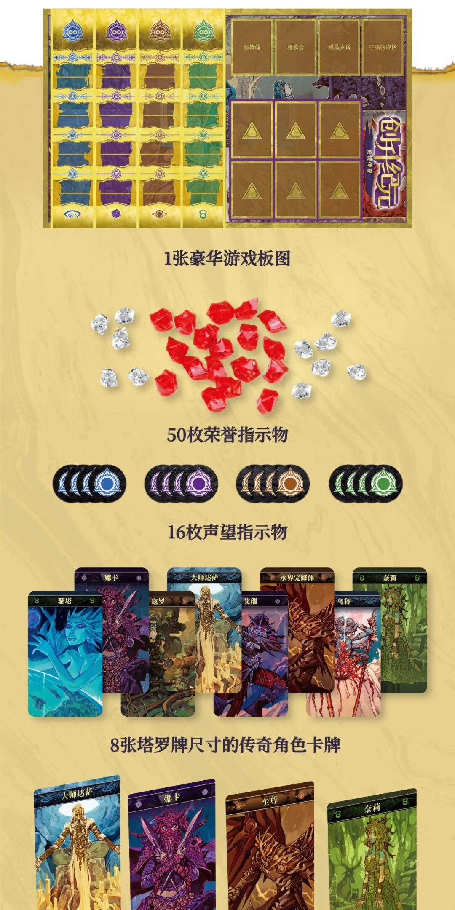

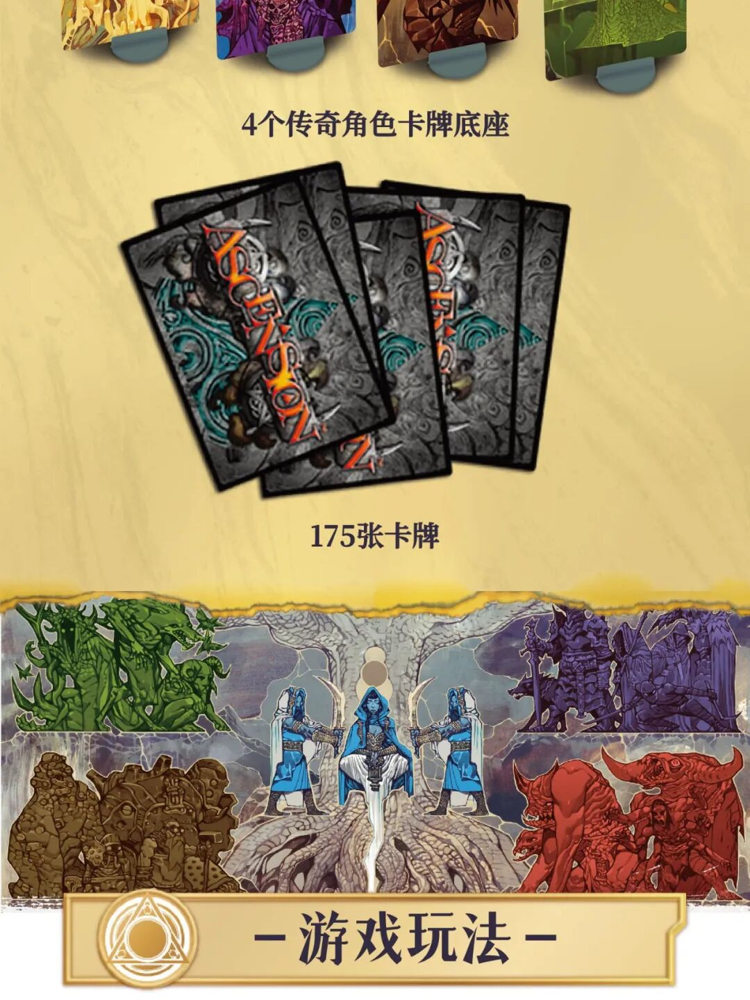

- 1 张豪华游戏板图
- 50 枚荣誉指示物
- 16 枚声望指示物
- 8 张塔罗牌尺寸的传奇角色卡牌（如瑟塔、娜卡、寇罗、大师达萨、艾璐、乌鲁、奈莉等）
- 4 个传奇角色卡牌底座
- 175 张卡牌

### 游戏玩法（史诗传奇）

#### 卡牌类型 · 英雄卡牌

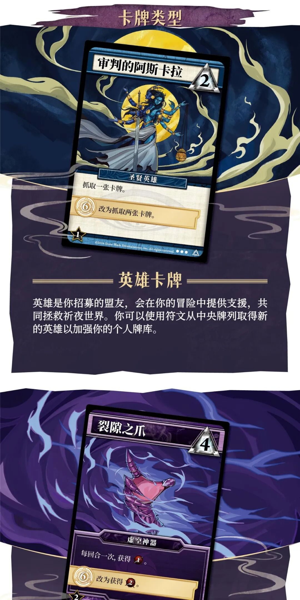

（示例卡：审判的阿斯卡拉，费用 2，圣贤英雄，「抓取一张卡牌。」6 改为抓取两张卡牌。）

英雄是你招募的盟友，会在你的冒险中提供支援，共同拯救祈夜世界。你可以使用符文从中央牌列取得新的英雄以加强你的个人牌库。

#### 卡牌类型 · 神器卡牌

（示例卡：裂隙之爪，费用 4，虚空神器，「每回合一次，获得 1。」6 改为获得 2。）

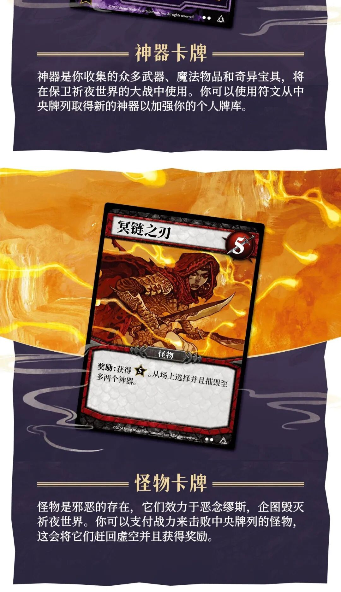

神器是你收集的众多武器、魔法物品和奇异宝具，将在保卫祈夜世界的大战中使用。你可以使用符文从中央牌列取得新的神器以加强你的个人牌库。

#### 卡牌类型 · 怪物卡牌

（示例卡：冥链之刃，费用 5，怪物，「奖励：获得 5。从场上选择并且摧毁至多两个神器。」）

怪物是邪恶的存在，它们效力于恶念缪斯，企图毁灭祈夜世界。你可以支付战力来击败中央牌列的怪物，这会将它们赶回虚空并且获得奖励。

#### 卡牌类型 · 传奇角色卡牌

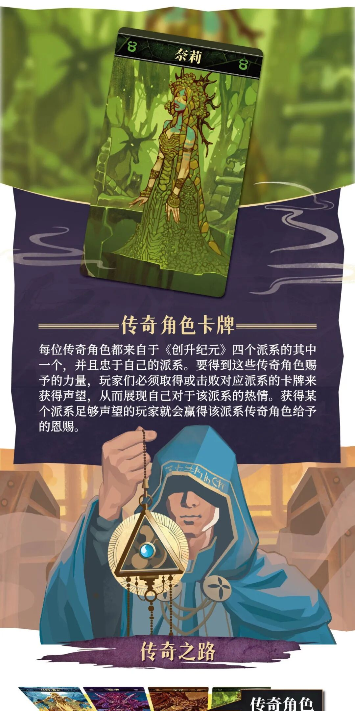

（示例卡：奈莉，荣誉值 8）

每位传奇角色都来自于《创升纪元》四个派系的其中一个，并且忠于自己的派系。要得到这些传奇角色赐予的力量，玩家们必须取得或击败对应派系的卡牌来获得声望，从而展现自己对于该派系的热情。获得某个派系足够声望的玩家就会赢得该派系传奇角色给予的恩赐。

#### 传奇之路

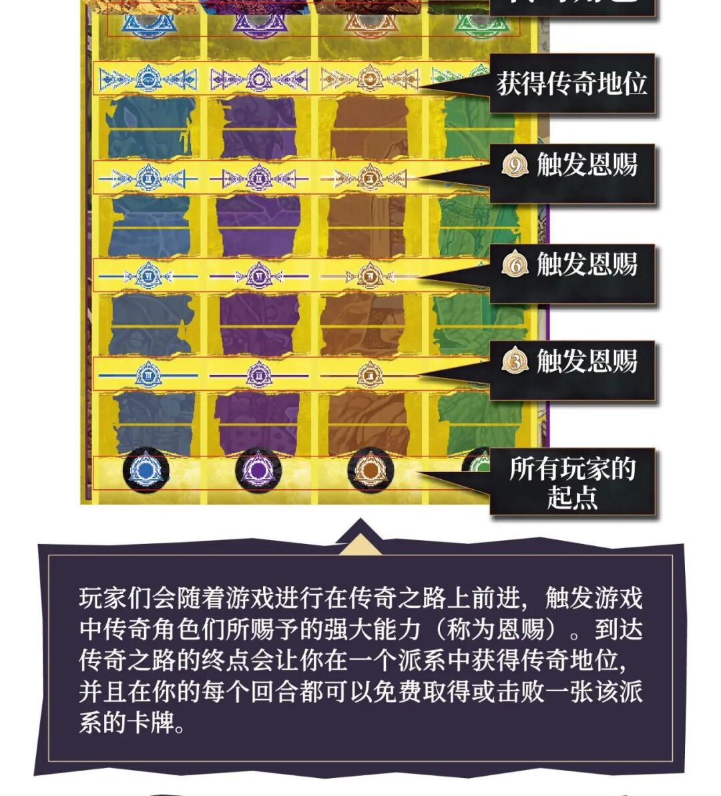

版图注记：所有玩家的起点 → 3 触发恩赐 → 6 触发恩赐 → 9 触发恩赐 → 获得传奇地位。

玩家们会随着游戏进行在传奇之路上前进，触发游戏中传奇角色们所赐予的强大能力（称为恩赐）。到达传奇之路的终点会让你在一个派系中获得传奇地位，并且在你的每个回合都可以免费取得或击败一张该派系的卡牌。

#### 游戏流程 · 回合行动

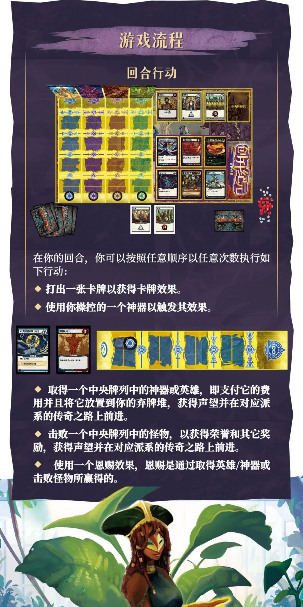

**在你的回合，你可以按照任意顺序以任意次数执行如下行动：**

- 打出一张卡牌以获得卡牌效果。
- 使用你操控的一个神器以触发其效果。
- 取得一个中央牌列中的神器或英雄，即支付它的费用并且将它放置到你的弃牌堆，获得声望并在对应派系的传奇之路上前进。
- 击败一个中央牌列中的怪物，以获得荣誉和其它奖励，获得声望并在对应派系的传奇之路上前进。
- 使用一个恩赐效果，恩赐是通过取得英雄/神器或击败怪物所赢得的。

#### 回合结束

在你完成了从手牌打出卡牌、取得英雄和神器、击败怪物这些行动之后，将剩余的所有手牌和本回合打出的所有英雄卡牌均放置到弃牌堆。你在回合结束时会失去所有尚未支付的所有资源。之后抓取五张卡牌作为你的手牌。

#### 游戏结束

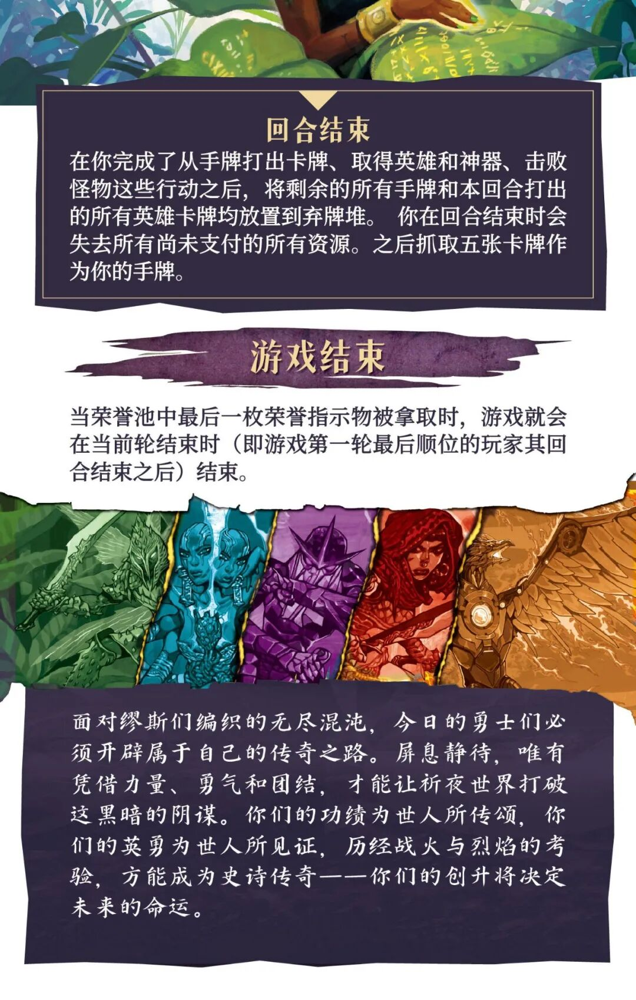

当荣誉池中最后一枚荣誉指示物被拿取时，游戏就会在当前轮结束时（即游戏第一轮最后顺位的玩家其回合结束之后）结束。

> 面对缪斯们编织的无尽混沌，今日的勇士们必须开辟属于自己的传奇之路。屏息静待，唯有凭借力量、勇气和团结，才能让祈夜世界打破这黑暗的阴谋。你们的功绩为世人所传颂，你们的英勇为世人所见证，历经战火与烈焰的考验，方能成为史诗传奇——你们的创升将决定未来的命运。

---

*来源：微信公众号「悠叶游YOUYEYOU」《创升纪元中文正版第四版 新品Ascension暗杀神卡牌DBG桌游游戏》，https://mp.weixin.qq.com/s/VJ53bUNrsGhUCj_h8XIggA · 规则内容归 Stone Blade Entertainment 及版权方所有，转录仅供个人学习查阅。*
