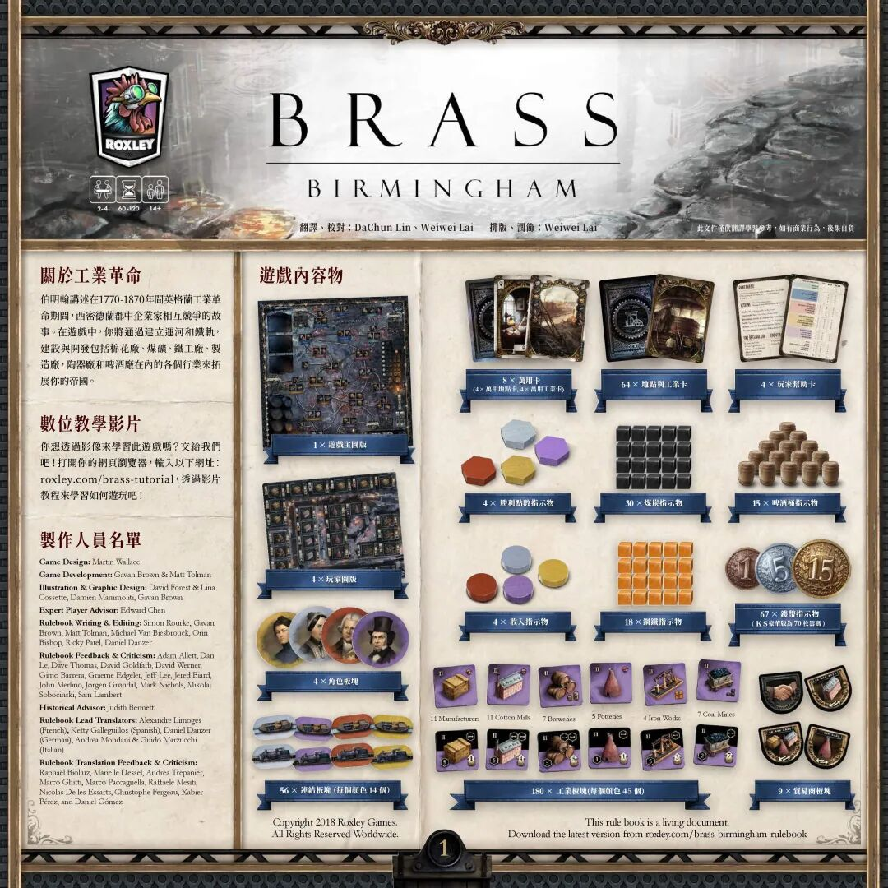
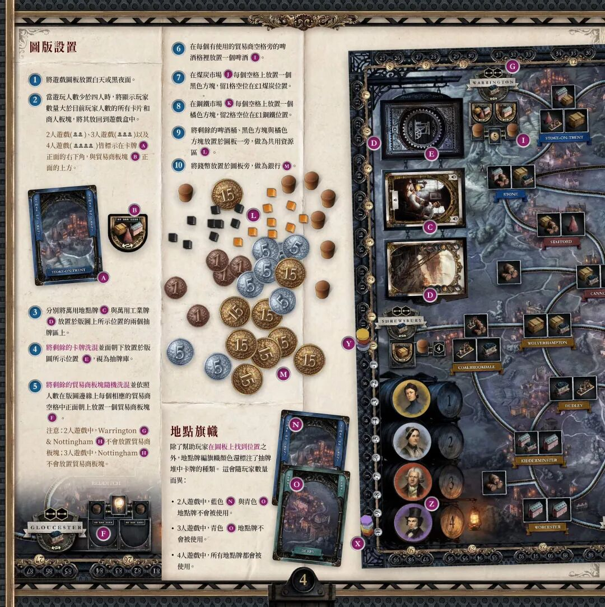
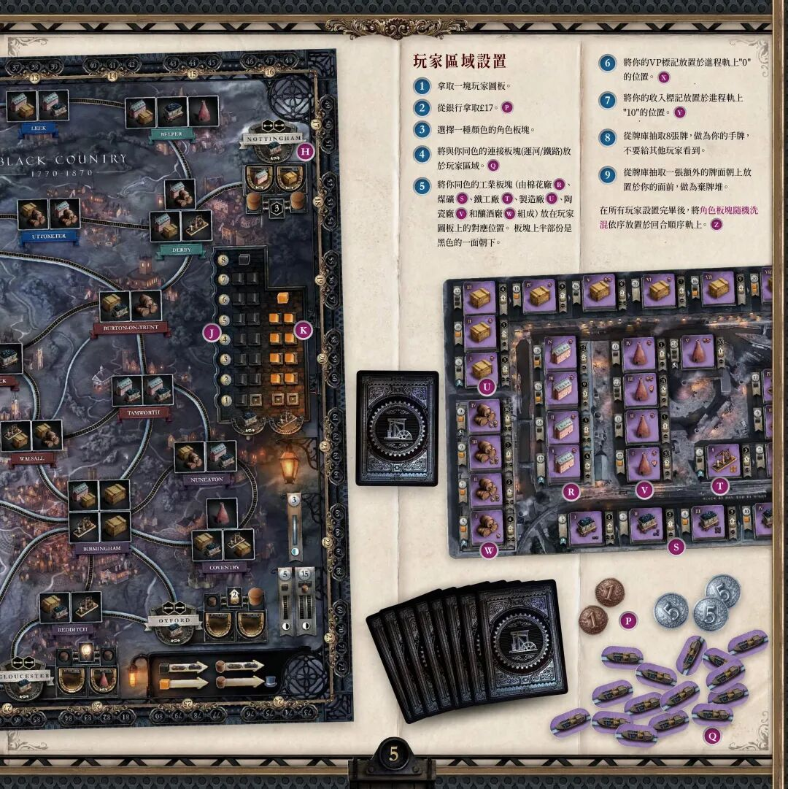
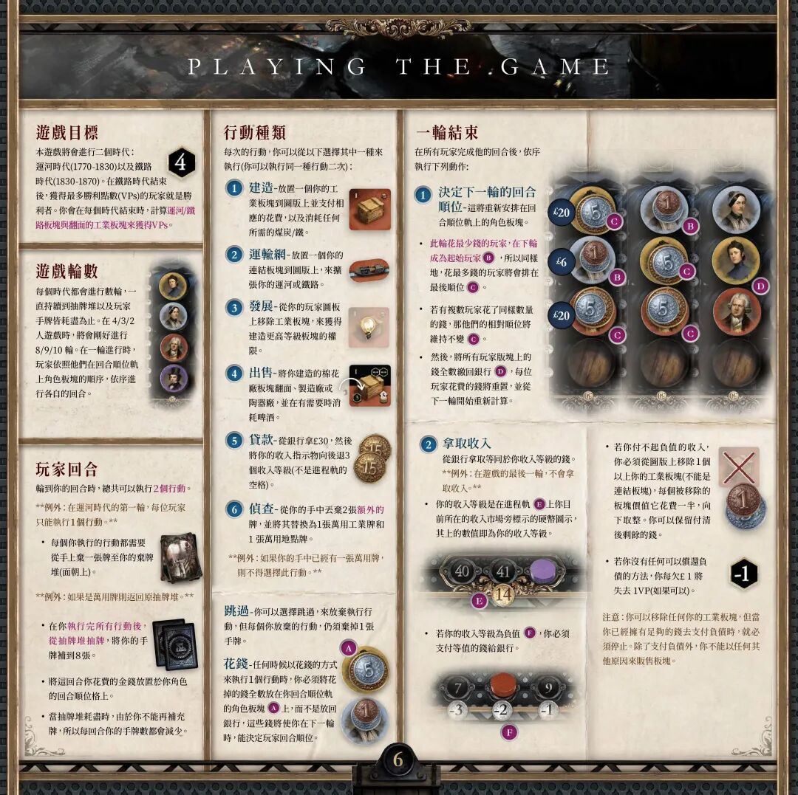
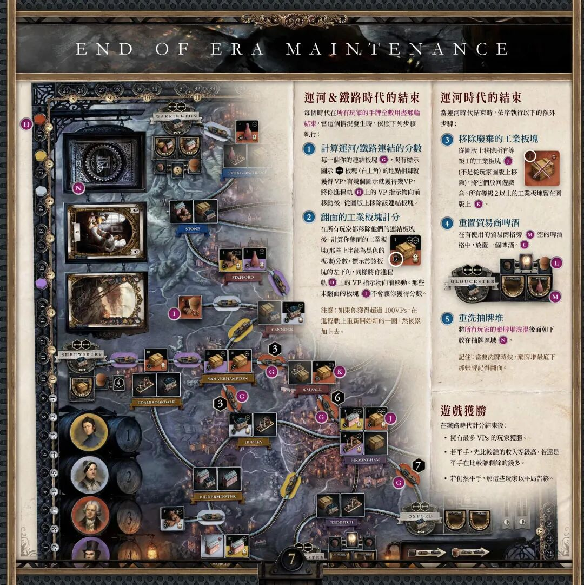
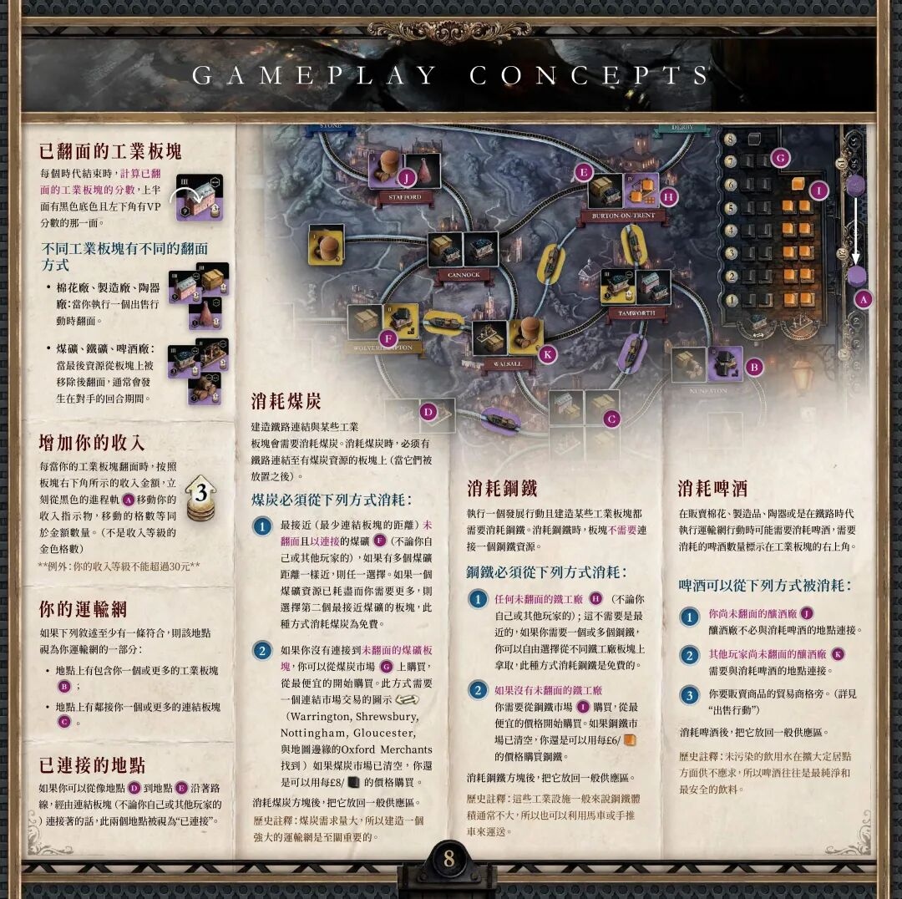
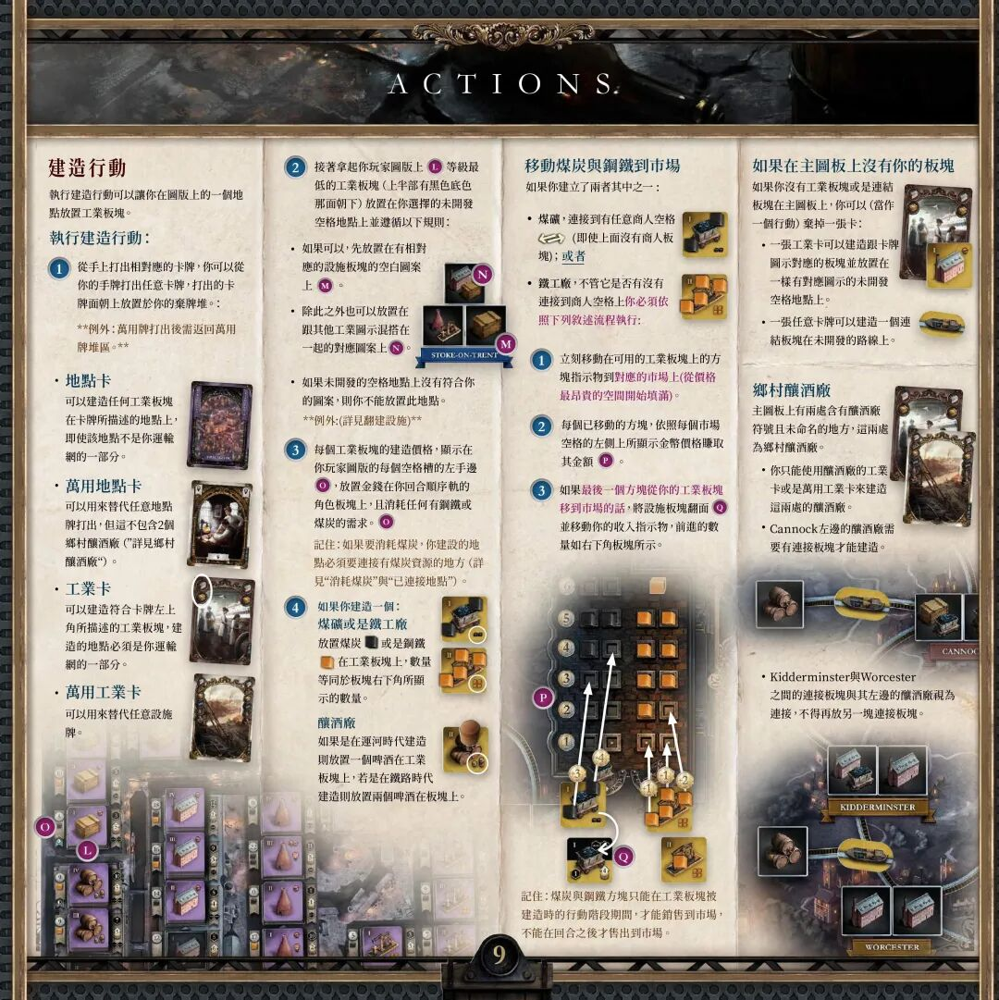
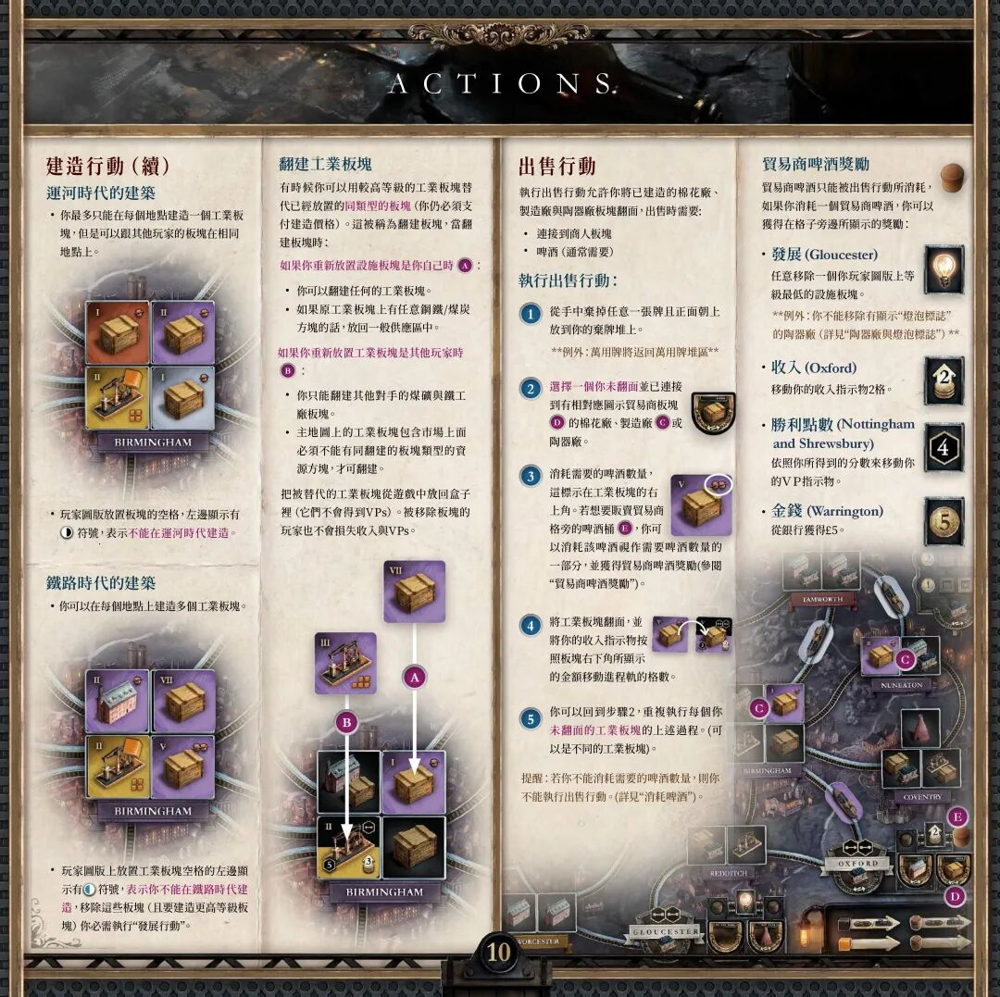
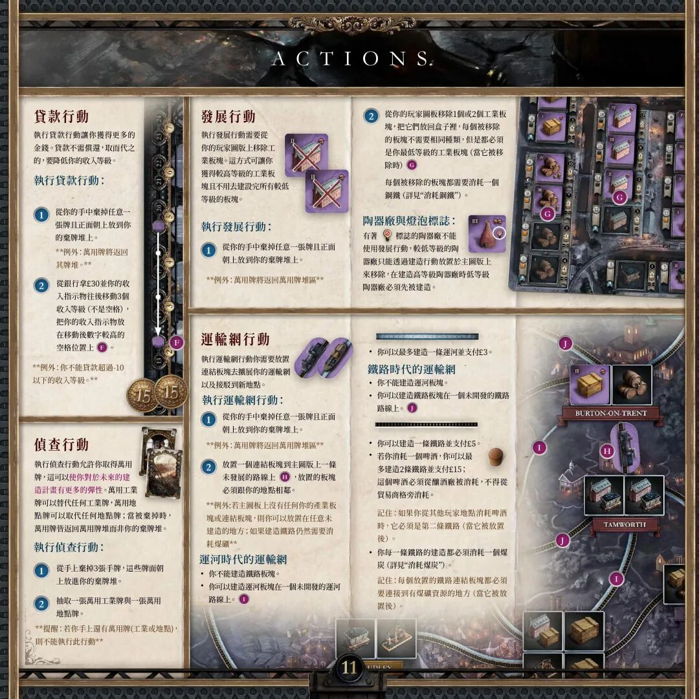
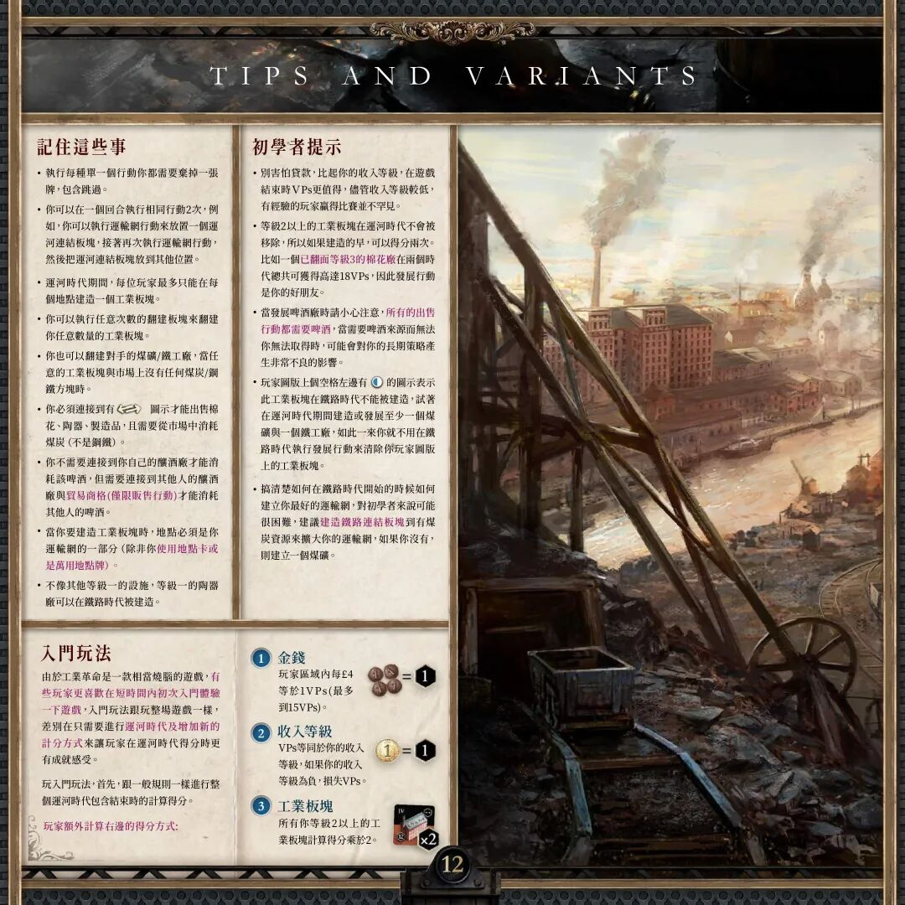

# 工业革命：伯明翰（Brass: Birmingham）

> 来源：微信公众号 · https://mp.weixin.qq.com/s/9p9dLk-auv57EnYaqD8pHA
> 依据 Roxley 官方繁体中文版规则书（翻译：DaChun Lin、Weiwei Lai）整理转录为简体。

**Brass: Birmingham（工业革命：伯明翰）**

游戏人数：2-4人　　　　游戏时长：60-120分钟　　　　年龄：14+

## 游戏简介

伯明翰讲述在 1770-1870 年间英格兰工业革命期间，西密德兰郡中企业家相互竞争的故事。在游戏中，你将通过建立运河和铁轨，建设与开发包括棉花厂、煤矿、铁工厂、制造厂、陶器厂和啤酒厂在内的各个行业来拓展你的帝国。

想通过影像学习游戏，可访问官方教程：roxley.com/brass-tutorial。

## 游戏内容物

### 图板与卡牌

| 数量 | 配件 |
| --- | --- |
| 1 | 游戏主图板 |
| 4 | 玩家图板 |
| 4 | 角色板块（人物肖像板块） |
| 8 | 万用卡（4 × 万用地点卡、4 × 万用工业卡） |
| 64 | 地点卡 |
| 4 | 玩家帮助卡 |

### 指示物

| 数量 | 配件 |
| --- | --- |
| 4 | 胜利点数指示物（六角形，四色） |
| 30 | 煤炭指示物（黑色方块） |
| 15 | 啤酒桶指示物 |
| 4 | 收入指示物（圆片，四色） |
| 18 | 钢铁指示物（橙色方块） |
| 67 | 钱币指示物（面额 1 / 5 / 15） |

### 板块

| 数量 | 配件 |
| --- | --- |
| 56 | 连接板块（运河船与火车，每种颜色 14 个） |
| 180 | 工业板块（每种颜色 45 个）：11 制造厂、11 棉花厂、7 啤酒厂、5 陶器厂、4 铁工厂、7 煤矿 |
| 9 | 贸易商板块（盾形） |

## 开局设置

（文中圆圈字母 A-O 为规则书页面配图中的标注位置）

1. 将游戏图板放置白天或黑夜面。
2. 当游玩人数少于四人时，将显示玩家数量大于目前玩家人数的所有卡牌和贸易商板块放回游戏盒中。2 / 3 / 4 人游戏图标皆标示在卡牌 (A) 正面的右下角，与贸易商板块 (B) 正面的上方。
3. 分别将万用地点牌 (C) 与万用工业牌 (D) 放置于版图上所示位置的两个抽牌区上。
4. 将剩余的卡牌洗混并面朝下放置于版图所示位置 (E)，视为抽牌库。
5. 将剩余的贸易商板块随机洗混并依照人数，在版图边缘每个相应的贸易商空格中正面朝上放置一个贸易商板块 (F)。注意：2 人游戏中，Warrington (G) 与 Nottingham (H) 不放置贸易商板块；3 人游戏中，Nottingham (H) 不放置贸易商板块。
6. 在每个有使用的贸易商空格旁的啤酒格里放置一个啤酒 (I)。
7. 在煤炭市场 (J) 每个空格上放置一个黑色方块，留 1 格空位在 £1 煤炭位置。
8. 在钢铁市场 (K) 每个空格上放置一个橙色方块，留 2 格空位在 £1 钢铁位置。
9. 将剩余的啤酒桶、黑色方块与橙色方块放置于图板一旁，做为共用资源区 (L)。
10. 将钱币放置于图板旁，做为银行 (M)。

### 地点旗帜

除了帮助玩家在图板上找到位置之外，地点牌组旗帜颜色还标注了抽牌堆中卡牌的种类。这会随玩家数量而异：

- 2 人游戏中，蓝色 (N) 与青色 (O) 地点牌不会被使用。
- 3 人游戏中，青色 (O) 地点牌不会被使用。
- 4 人游戏中，所有地点牌都会被使用。

## 玩家区域设置

1. 拿取一块玩家图板。
2. 从银行拿取 £17。(P)
3. 选择一种颜色的角色板块。
4. 将与你同色的连接板块（运河 / 铁路）放置于玩家区域。(Q)
5. 将你同色的工业板块（棉花厂 (R)、煤矿 (S)、铁工厂 (T)、制造厂 (U)、陶器厂 (V)、啤酒厂 (W)）放在玩家图板上的对应位置。板块上半部分是黑色的一面朝下。
6. 将你的 VP 标记放置于进度轨上 "0" 的位置。(X)
7. 将你的收入标记放置于进度轨上 "10" 的位置。(Y)
8. 从牌库抽取 8 张牌，作为你的手牌，不要给其他玩家看到。
9. 从牌库抽取一张额外的牌面朝上放置于你的面前，作为弃牌堆。

在所有玩家设置完毕后，将**角色板块随机洗混**，依序放置于回合顺序轨上。(Z)

## 游戏目标

本游戏将会进行两个时代：**运河时代（1770-1830）**以及**铁路时代（1830-1870）**。在铁路时代结束后，获得最多胜利点数（VPs）的玩家就是胜利者。你会在每个时代结束时，计算**运河 / 铁路板块与翻面的工业板块**来获得 VPs。

## 游戏轮数

每个时代都会进行数轮，一直持续到抽牌堆以及玩家手牌皆耗尽为止。在 4 / 3 / 2 人游戏时，将会刚好进行 **8 / 9 / 10 轮**。在一轮进行时，玩家依照他们在回合顺位轨上角色板块的顺序，依序进行各自的回合。

## 玩家回合

轮到你的回合时，总共可以执行 **2 个行动**。

**例外：在运河时代的第一轮，每位玩家只能执行 1 个行动。**

- 每个你执行的行动都需要从手上弃一张牌至你的弃牌堆（面朝上）。例外：如果是万用牌则返回原抽牌堆。
- 在你**执行完所有行动后，从抽牌堆抽牌**，将你的手牌补到 8 张。
- 将这回合你花费的金钱放置于你角色的回合顺位格上。
- 当抽牌堆耗尽时，由于你不能再补充手牌，所以每回合你的手牌数都会减少。

## 行动种类

每次的行动，你可以从以下选择其中一种来执行（你可以执行同一种行动两次）：

1. **建造** — 放置一个你的工业板块到图版上并支付相应的花费，以及消耗任何所需的煤炭 / 钢铁。
2. **运输网** — 放置一个你的连接板块到图版上，来扩张你的运河或铁路。
3. **发展** — 从你的玩家图板上移除工业板块，来获得建造更高等级板块的权限。
4. **出售** — 将你建造的棉花厂、制造厂或陶器厂板块翻面，并在有需要时消耗啤酒。
5. **贷款** — 从银行拿 £30，然后将你的收入指示物向后退 3 个收入等级（不是进程轨的空格）。
6. **侦查** — 从你的手中丢弃 2 张额外的牌，并将其替换为 1 张万用工业牌和 1 张万用地点牌。例外：如果你的手中已经有一张万用牌，则不得选择此行动。

**跳过** — 你可以选择跳过，来放弃执行行动，但每个你放弃的行动，仍须弃掉 1 张手牌。

**花钱** — 任何时候以花钱的方式来执行 1 个行动时，你必须将花掉的钱全数放在你回合顺位轨的角色板块上，而不是放回银行。这些钱将使你在下一轮时，能决定玩家回合顺位。

## 一轮结束

在所有玩家完成他的回合后，依序执行下列动作：

### 1. 决定下一轮的回合顺位

- 此轮花最少钱的玩家，在下轮**成为起始玩家**；同样地，花最多钱的玩家将会排在最后顺位。
- 若有复数玩家花了同样数量的钱，那他们的相对顺位将维持不变。
- 然后，将所有玩家板块上的钱全数缴回银行，每位玩家花费的钱将重置，并从下一轮开始重新计算。

### 2. 拿取收入

从银行拿取等同于你收入等级的钱。**例外：在游戏的最后一轮，不会拿取收入。**

- 你的收入等级是在进程轨上你目前所在的收入市场旁标示的硬币图示，其上的数值即为你的收入等级。
- 若你的收入等级为负值，你必须支付等值的钱给银行。
- 若你付不起负值的收入，你必须从图版上移除 1 个以上你的工业板块（不能是连接板块），每个被移除的板块价值它花费的一半（向下取整）。你可以保留付清后剩余的钱。
- 若你没有任何可以偿还负债的方法，你每欠 £1 将失去 1 VP（如果可以）。

注意：你可以移除任何你的工业板块来抵债，但当你已经拥有足够的钱去支付负债时，就必须停止。除了支付负债外，你不能以任何其他原因来贩卖板块。

## 时代结束与计分

每个时代在**所有玩家的手牌全数用尽的那一轮结束**。当这个情况发生时，依照下列步骤执行：

### 运河与铁路时代的结束

1. **计算运河 / 铁路连接的分数** — 每一个你的连接板块，与有标示连接图示（位于地点板块右上角）的地点相邻就获得 VP，有几个图示就获得几 VP。将你进程轨上的 VP 指示物向前移动后，从图板上移除该连接板块。
2. **翻面的工业板块计分** — 在所有玩家都移除他们的连接板块后，计算你翻面的工业板块（那些上半部为黑色的板块）分数，分数标示于该板块的左下角，同样将你进程轨上的 VP 指示物向前移动。那些未翻面的板块不会让你获得分数。

注意：如果你获得超过 100 VPs，在进程轨上重新开始新的一圈，然后累加上去。

### 运河时代的结束

当运河时代结束时，依序执行以下的额外步骤：

3. **移除废弃的工业板块** — 从图板上移除所有等级 1 的工业板块（不是从玩家图板上移除），将它们放回游戏盒。所有等级 2 以上的工业板块留在图版上。
4. **重置贸易商啤酒** — 在有使用的贸易商格旁空的啤酒格中，放置一个啤酒。
5. **重洗抽牌堆** — 将所有玩家的**弃牌堆洗混**后面朝下放在抽牌区域。记住：洗牌时，弃牌堆最底下那张牌记得翻面。

### 游戏获胜

在铁路时代计分结束后：

- 拥有最多 VPs 的玩家获胜。
- 若平手，先比较谁的收入等级高，若还是平手再比较谁剩余的钱多。
- 若仍然平手，那这些玩家以平局告终。

## 游戏概念

### 已翻面的工业板块

每个时代结束时，计算**已翻面的工业板块**的分数：上半面有黑色底色且左下角有 VP 分数的那一面。

### 不同工业板块有不同的翻面方式

- **棉花厂、制造厂、陶器厂**：当你执行一个出售行动时翻面。
- **煤矿、铁工厂、啤酒厂**：当最后资源从板块上被移除后翻面，通常会发生在对手的回合期间。

### 增加你的收入

每当你的工业板块翻面时，按照板块右下角所示的收入金额，立刻在黑色的进程轨上移动你的收入指示物，移动的格数等同于金额数量（不是收入等级的金色格数）。**例外：你的收入等级不能超过 30。**

### 你的运输网

如果下列叙述至少有一条符合，则该地点视为你运输网的一部分：

- 地点上包含你一个或更多的工业板块；
- 地点上邻接你一个或更多的连接板块。

### 已连接的地点

如果你可以从地点 D 沿着路线，经由连接板块（不论你自己或其他玩家的）连接到地点 E，此两个地点被视为"已连接"。

### 消耗煤炭

建造铁路连接与某些工业板块会需要消耗煤炭。消耗煤炭时，必须有连接（运河 / 铁路）至有煤炭资源的板块上。

煤炭必须从下列方式消耗：

1. 最接近（最少连接板块的距离）**未翻面且已连接**的煤矿（不论你自己或其他玩家的），如果有多个煤矿距离一样近，则任一选择。如果一个煤矿资源已耗尽而你需要更多，则选择第二个最接近的煤矿板块。此种方式消耗煤炭为免费。
2. 如果你没有连接到未翻面的煤矿板块，你可以从煤炭市场上购买，从最便宜的开始购买。此方式需要一个连结市场交易的图示（Warrington、Shrewsbury、Nottingham、Gloucester，与地图边缘的 Oxford Merchants 处可以找到）。如果煤炭市场已清空，你还是可以用每单位 **£8** 的价格购买。

消耗煤炭方块后，把它放回一般供应区。

历史注解：煤炭需求量大，所以建造一个强大的运输网是至关重要的。

### 消耗钢铁

执行一个发展行动且建造某些工业板块都需要消耗钢铁。消耗钢铁时，板块**不需要**连接一个钢铁资源。

钢铁必须从下列方式消耗：

1. **任何未翻面的铁工厂**（不论你自己或其他玩家的）——这不需要是最近的，如果你需要一个或多个钢铁，你可以自由选择从不同铁工厂板块上拿取。此种方式消耗钢铁是免费的。
2. **如果没有未翻面的铁工厂**，你需要从钢铁市场上购买，从最便宜的价格开始购买。如果钢铁市场已清空，你还是可以用每单位 **£6** 的价格购买钢铁。

消耗钢铁方块后，把它放回一般供应区。

历史注解：这些工业设施一般说来钢铁体积通常不大，所以也可以利用马车或手推车来运送。

### 消耗啤酒

在贩卖棉花、制造品、陶器或是在铁路时代执行运输网行动时可能需要消耗啤酒，需要消耗的啤酒数量标示在工业板块的右上角。

啤酒可以从下列方式被消耗：

1. **你尚未翻面的啤酒厂**：啤酒厂不必与消耗啤酒的地点连接。
2. **其他玩家尚未翻面的啤酒厂**：需要与消耗啤酒的地点连接。
3. 你要贩卖商品的贸易商格旁（详见"出售行动"）。

消耗啤酒后，把它放回一般供应区。

历史注解：未污染的饮用水在扩大定居点方面供不应求，所以啤酒往往是最纯净和最安全的饮料。

## 行动详解

### 建造行动

执行建造行动可以让你在图版上的一个地点放置工业板块。

**执行建造行动：**

1. **从手上打出相对应的卡牌**：你可以从你的手牌打出任意卡牌，打出的卡牌面朝上放置于你的弃牌堆。**例外：万用牌打出后需返回万用牌堆区。**
   - **地点卡**：可以建造任何工业板块在卡牌所描述的地点上，即使该地点不是你运输网的一部分。
   - **万用地点卡**：可以用来替代任意地点牌打出，但这不包含 2 个乡村啤酒厂（详见"乡村啤酒厂"）。
   - **工业卡**：可以建造符合卡牌左上角所描述的工业板块，建造的地点必须是你运输网的一部分。
   - **万用工业卡**：可以用来替代任意工业牌。
2. **拿起你玩家图版上等级最低的工业板块**（上半部有黑色底色那面朝下）放置在你选择的未开发空格地点上，并遵循以下规则：
   - 如果可以，先放置在有相对应的工业板块图案的空白上。
   - 除此之外也可以放置在跟其他工业图示混搭在一起的对应图案上。
   - 如果未开发的空格地点上没有符合你的图案，则你不能放置在此地点。**例外：详见"翻建工业板块"。**
3. 每个工业板块的建造价格，显示在你玩家图版的每个空格槽的左手边。放置金钱在你回合顺序轨的角色板块上，并消耗任何所需的钢铁或煤炭。
   记住：如果要消耗煤炭，你建设的地点必须连接有煤炭资源的地方（详见"消耗煤炭"与"已连接的地点"）。
4. 如果你建造的是一个：
   - **煤矿或铁工厂** — 放置煤炭或钢铁在工业板块上，数量等同于板块右下角所显示的数量。
   - **啤酒厂** — 如果是在运河时代建造则放置一个啤酒在工业板块上，若是在铁路时代建造则放置两个啤酒在板块上。

**移动煤炭与钢铁到市场**

如果你建立了以下两者其中之一：

- 煤矿，连接到有任意贸易商空格的地点（连接图示）（即使上面没有贸易商板块）；或者
- 铁工厂，不管它是否有连接到贸易商空格上。

你必须依照下列流程执行：

1. 立刻移动可用工业板块上的方块指示物到对应的市场上（从价格最昂贵的空间开始填满）。
2. 每个已移动的方块，依照每个市场空格左侧所显示的金币价格赚取其金额。
3. 如果最后一个方块从你的工业板块移到市场的话，将该工业板块翻面，并移动你的收入指示物，前进的数量如板块右下角所示。

记住：煤炭与钢铁方块只能在工业板块被建造时的行动阶段期间才能销售到市场，不能在回合之后才售出到市场。

**如果在主图板上没有你的板块**

如果你没有工业板块或连接板块在主图板上，你可以（当作一个行动）弃掉一张卡：

- 一张工业卡可以建造跟卡牌图示对应的板块，放置在同样有对应图示的未开发空格地点上。
- 一张任意卡牌可以建造一个连接板块在未开发的路线上。

**乡村啤酒厂**

主图板上有两处含有啤酒厂符号且未命名的地点，这两处为乡村啤酒厂。

- 你只能使用啤酒厂的工业卡或万用工业卡来建造这两处的啤酒厂。
- Cannock 左边的啤酒厂需要有连接板块才能建造。
- Kidderminster 与 Worcester 之间的连接板块，与其左边的啤酒厂视为已连接，不得再放另一块连接板块。

**运河时代的建筑**

- 你最多只能在每个地点建造一个工业板块，但是可以跟其他玩家的板块在相同地点上。
- 玩家图版上放置板块空格的左边显示有右半黑圆符号，表示不能在运河时代建造。

**铁路时代的建筑**

- 你可以在每个地点上建造多个工业板块。
- 玩家图版上放置工业板块空格的左边显示有左半黑圆符号，表示你不能在铁路时代建造；移除这些板块（且要建造更高等级板块）你必须执行"发展行动"。

**翻建工业板块**

有时候你可以用较高等级的工业板块替代已经放置的同类型的板块（你仍必须支付建造价格）。这被称为翻建板块。当翻建板块时：

- **如果被翻建的板块是你自己的：**
  - 你可以翻建任何的工业板块。
  - 如果原工业板块上有任意钢铁 / 煤炭方块的话，放回一般供应区中。
- **如果被翻建的板块是其他玩家的：**
  - 你只能翻建其他对手的煤矿与铁工厂板块。
  - 主地图上被翻建的板块上面必须不能有任何资源方块，才可翻建。

把被替代的工业板块从游戏中移出、放回盒子里（它们不会得到 VPs）。被移除板块的玩家也不会损失收入与 VPs。

### 出售行动

执行出售行动允许你将已建造的棉花厂、制造厂与陶器厂板块翻面。出售时需要：

- 连接到贸易商板块；
- 啤酒（通常需要）。

**执行出售行动：**

1. 从手中弃掉任意一张牌且正面朝上放到你的弃牌堆上。**例外：万用牌将返回万用牌堆区。**
2. 选择一个你未翻面并已连接到有相对应图示贸易商板块的棉花厂、制造厂或陶器厂。
3. 消耗需要的啤酒数量，这标示在工业板块的右上角。若想要消耗贸易商格旁的啤酒桶，你可以消耗该啤酒视作需要啤酒数量的一部分，并获得贸易商啤酒奖励（参阅"贸易商啤酒奖励"）。
4. 将工业板块翻面，并将你的收入指示物按照板块右下角所显示的金额，在进程轨上移动格数。
5. 你可以回到步骤 2，重复执行每个你未翻面的工业板块的上述过程（可以是不同的工业板块）。

提醒：若你不能消耗需要的啤酒数量，则你不能执行出售行动（详见"消耗啤酒"）。

**贸易商啤酒奖励**

贸易商啤酒只能被出售行动所消耗。如果你消耗一个贸易商啤酒，你可以获得在格子旁边所显示的奖励：

- **发展（Gloucester）**：任意移除一个你玩家图版上等级最低的工业板块。**例外：你不能移除有显示"烧瓶标志"的陶器厂**（详见"发展行动"）。
- **收入（Oxford）**：移动你的收入指示物 2 格。
- **胜利点数（Nottingham 和 Shrewsbury）**：依照格子所示的分数移动你的 VP 指示物。
- **金钱（Warrington）**：从银行获得 £5。

### 贷款行动

执行贷款行动让你获得更多的金钱。贷款不需担保，然而代之的是，要降低你的收入等级。

**执行贷款行动：**

1. 从你的手中弃掉任意一张牌并且正面朝上放到你的弃牌堆上。**例外：万用牌将返回万用牌堆。**
2. 从银行拿取 £30，并将你的收入指示物往回移动 3 级收入等级（不是进程轨的空格），把你的收入指示物放在移动后数字较高的空格位置上。

**例外：你不能贷款超过 10 以下的收入等级。**

### 侦察行动

执行侦查行动允许你弃掉万用牌，还可以让你对未来的建造计划有更多弹性。你可以弃掉和更换任何三张牌。万用地点牌可以取代任何地点牌；当被弃掉时，万用牌将返回万用牌堆而非你的弃牌堆。

**执行侦察行动：**

1. 从手上弃掉 3 张手牌：这些牌面朝上放到你的弃牌堆。
2. 抽取一张万用工业牌与一张万用地点牌。

规则：若你手上有万用牌（工业或地点），即不能执行此行动。

### 发展行动

执行发展行动需要弃掉你的玩家图板上的工业板块。这方法允许你弃掉较高等级的工业板块，即使尚未建造完成所有较低等级的板块。

**执行发展行动：**

1. 从你的手中弃掉任意一张牌并且正面朝上放到你的弃牌堆上。**例外：万用牌将返回万用牌堆。**
2. 从你的玩家图板移除 1 或 2 个工业板块，把它们放回盒子里。每个被移除的板块不需要同种类，但每个都必须是（移除当下）**你最低等级**的工业板块。

每个被移除的板块都需要消耗一个钢铁（铁锭图标）。

**陶器厂与马口铁厂标志**

有着（烧瓶图标）标志的陶器厂不能使用发展行动移除。低等级的陶器厂只能通过建造行动放置于主图板上；在建造高等级陶器厂和马口铁厂时，低等级陶器厂必须先被建造。

### 运输网行动

执行运输网行动你可以放置连接板块来扩张你的运输网以及连接到邻近地点。

**执行运输网行动：**

1. 从你的手中弃掉任意一张牌并且正面朝上放到你的弃牌堆上。**例外：万用牌将返回万用牌堆。**
2. 放置一个连接板块到主图板上一条未发展的路径上，放置的板块必须与你（运输网）的产业相邻。

规则：若主图板上没有任何你的产业板块，则你可以放置在任意未建设的地方；如果放置后仍未连接到你的运输网，它将在运河时代结束时被移除。

**运河时代的运输网**

- 你最多可以建造一条运河并支付 £3*。
- 你不能建造铁路板块。
- 你可以建造运河板块在任一条未开发的运河路径上。

**铁路时代的运输网**

- 你可以建造一条铁路并支付 £5*。
- 若该路径上有一条运河，你必须支付双倍费用（£10）：运河板块将被移除，由你的铁路连接取代，不再计入（对手的）运输网。
- 你每建造一条铁路都必须消耗一个煤炭。
- 注：每个放置的铁路连接板块都必须覆盖在现有的运河 / 铁路连接板块之上（当它被放置时）。

## 提示与变体

### 记住这些事

- 执行任何单个行动你都需要弃掉一张牌（包含跳过）。
- 你可以在一个回合执行相同行动 2 次；例如：你可以执行运输网行动来放置一个运河连接此地，接着再次执行运输网行动，把另一块连接板块放到其他位置。
- 运河时代期间，每位玩家最多只能在每个地点建造一个工业板块。
- 你可以执行任意次数的翻建，翻建你任意数量的工业板块（付费的前提下）。
- 你也可以翻建对手的铁工厂，当该工业板块上没有任何煤炭 / 钢铁方块时。
- 出售棉花、制造品、陶器时需要消耗啤酒，且啤酒可以从贸易商处获得（不是只能从啤酒厂）。
- 你不需要连接到你自己的啤酒厂就能消耗其啤酒，但需要连接到其他人的啤酒厂才能消耗其他人的啤酒。
- 当你要建造工业板块时，地点必须是你运输网的一部分（除非你使用地点卡）。
- 不像其他等级的设施，等级一的啤酒厂可以在铁路时代被建造。

### 初学者提示

- 比起你的收入等级，游戏结束时的 VPs 更重要；有经验的玩家扩张收入等级只是为了更好的现金流。
- 等级 2 以上的工业板块在运河时代结束时不会被移除，所以如果建造得早，可以得分两次。比如一个已翻面的等级 3 棉花厂在铁路时代里已可获得高达 18 VPs，因此早期建造是你的好朋友。
- 当建造啤酒厂时请小心注意！所有的出售行动都需要啤酒，需要啤酒时却无法取得会很遗憾，可能对你的长期路线产生非常不好的影响。
- 玩家图板上（打叉图标）表示此工业板块在铁路时代不能被建造；试着在运河时代期间建造它，或发展跳过它，如此一来你就不用在铁路时代浪费行动来清除玩家图版上的工业板块。
- 规划清楚如何在铁路时代开始时建立你最好的运输网；对初学者来说可能很困难，建议让你的运输网连接拥有煤炭资源的铁路连接板块；如果你没有，则建造一个煤矿。

### 入门玩法

由于《工业革命：伯明翰》是一款相当复杂的游戏，有些玩家更喜欢在短时间内进行「入门体验」。这个入门玩法与玩整场游戏一样，差别只在只需进行运河时代，并增加新的计分方式，来让玩家在运河时代得分时能有成就感。

玩入门玩法，首先和一般规则一样进行整备；运河时代结束时进行计分。玩家额外计算以下得分方式：

1. **金钱** — 玩家每拥有 £4 获得 1 VP（最多到 5 VPs）。
2. **收入等级** — VPs 等同于你的收入等级；如果你的收入等级为负，损失 VPs。
3. **工业板块** — 所有你等级 2 以上的工业板块计算分数 ×2。
