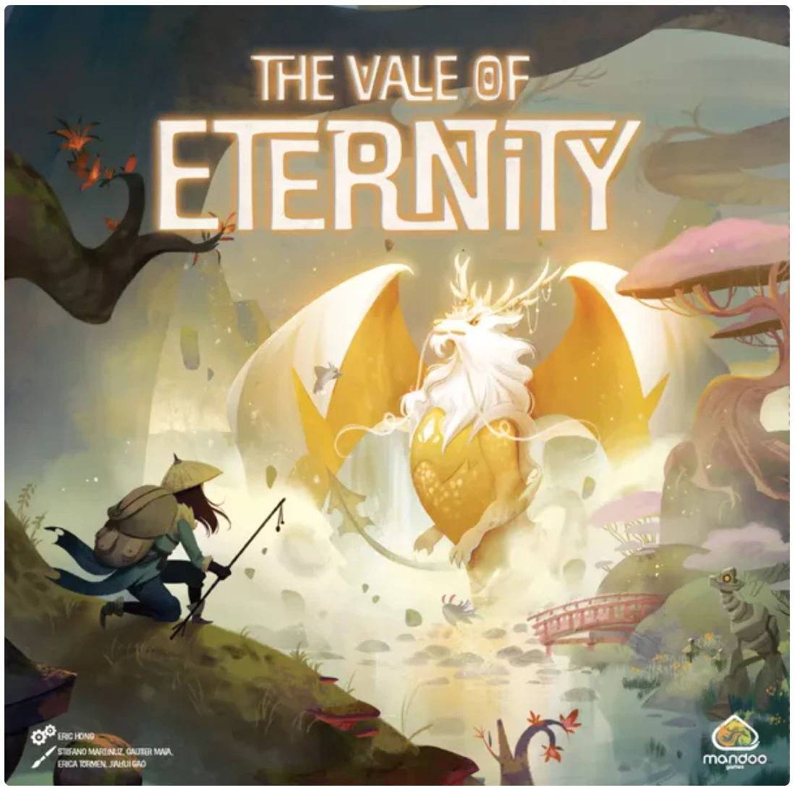
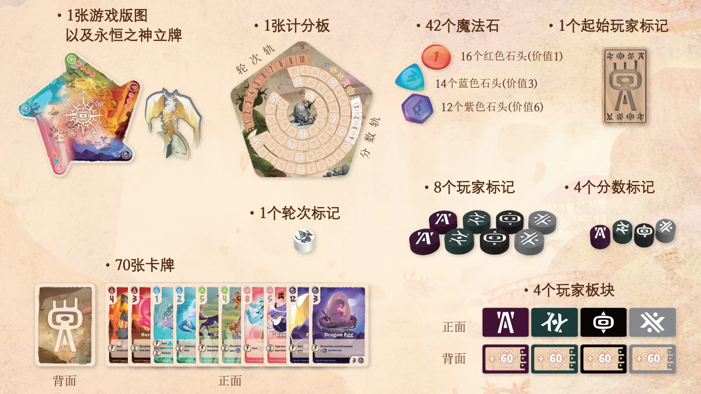
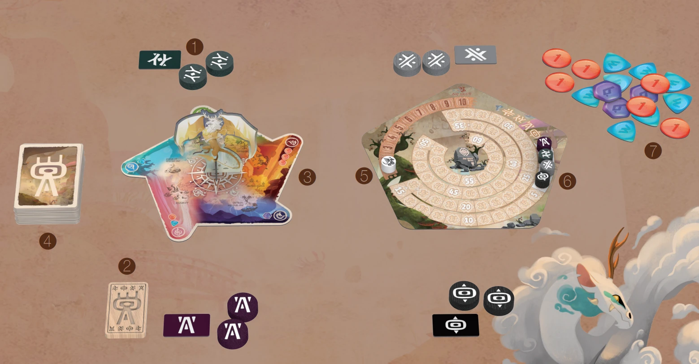

# 永恒之谷（The Vale of Eternity）

> 来源：B站文章 · https://www.bilibili.com/opus/890774653861101571

**The Vale of Eternity（永恒之谷）**

游戏人数：2-4人　　　　　　游戏时长：30-45分钟

## 游戏目标

在一个奇幻世界中，玩家们作为驯兽师，将会狩猎并驯服各种生物。驯服最顶尖生物的玩家将会赢得游戏胜利。

## 游戏配件

## 游戏设置

1. 每位玩家选择一个颜色并拿取对应颜色的2个玩家标记和1个玩家板块。
2. 随机决定一位起始玩家，拿取起始玩家标记。
3. 将游戏版图和计分板放置在桌面中央。
4. 洗混所有卡牌形成抽牌堆，放置到便于拿取的地方。
5. 将轮次标记放置到轮次轨的起始位置上。
6. 每位玩家将各自的分数标记放置到分数轨等同于自己顺位的分值上。
7. 将所有魔法石放置到一旁，形成供应堆。

## 游戏流程

游戏进行若干轮(通常为8-10轮)，每一轮分为3个阶段：

### 1、狩猎阶段

- a、从抽牌堆中翻开等同于玩家人数两倍的卡牌，将这些卡牌按左上角的不同元素分开并放置到游戏版图的对应区域旁。
- b、从起始玩家开始，按照顺时针顺序，每位玩家轮流选择一张没有放置标记的卡牌，并将自己的玩家标记放置到该卡牌上。
- c、然后，从末位玩家开始，按照逆时针顺序，每位玩家轮流选择第二张卡牌并将自己剩余的玩家标记放置到所选卡牌上。

### 2、行动阶段

从起始玩家开始，每位玩家轮流进行自己的回合。在你的回合中，你可以任意顺序执行以下行动任意次数：

- a、卖掉一张卡牌：选择放有你玩家标记的一张卡牌，将玩家标记收回手中并弃除这张卡牌，然后根据卡牌所属元素获得对应类型和数量的魔法石(标识在游戏版图上)。

  注意：玩家拥有的魔法石数量上限为4(不论种类)；玩家不能将拥有的魔法石与供应堆中的魔法石进行转换。

- b、驯服一张卡牌：选择放有你玩家标记的一张卡牌，将玩家标记收回手中并将该卡牌加入手中。玩家可以拥有的手牌数量没有上限。

- c、召唤一张卡牌：首先，检查你的玩家区域是否已满。玩家面前可以打出的卡牌数量等同于当前游戏轮次。如果玩家区域已满，则不能执行此行动。

  否则，你可以选择一张手中的卡牌，支付左上角所示价值的魔法石，将其面朝上召唤到你的玩家区域中。然后你立即结算该卡牌的即时效果(如果有的话)。

  注意：如果你支付了超出费用的魔法石，不会从供应堆中找零。

- d、移除一张卡牌：选择自己玩家区域中的一张卡牌，支付等同于当前轮次的费用，将这张卡牌移除。

### 3、结算阶段

从起始玩家开始，每位玩家轮流激活自己玩家区域中所有带有沙漏图标的卡牌效果。

## 一轮结束

在结算阶段之后，一轮结束。如果此时没有触发游戏结束条件，则执行以下两个步骤：

1. 将轮次标记移动到下一个位置中；
2. 将起始玩家标记传给左手边的玩家。

## 游戏结束

在一轮结束时，如果有玩家分数达到60分或更多，游戏立即结束。或者，如果这是游戏的第十轮，则该轮结束后游戏结束。

分数最高的玩家赢得游戏胜利。如果出现平手，平手玩家中召唤了更多卡牌的玩家获胜；如果依然平手，则平手玩家共享游戏胜利。

---

*作者：啃规则的Lancer（B站UID 474881786）· 编辑于 2024年01月26日 18:56*
